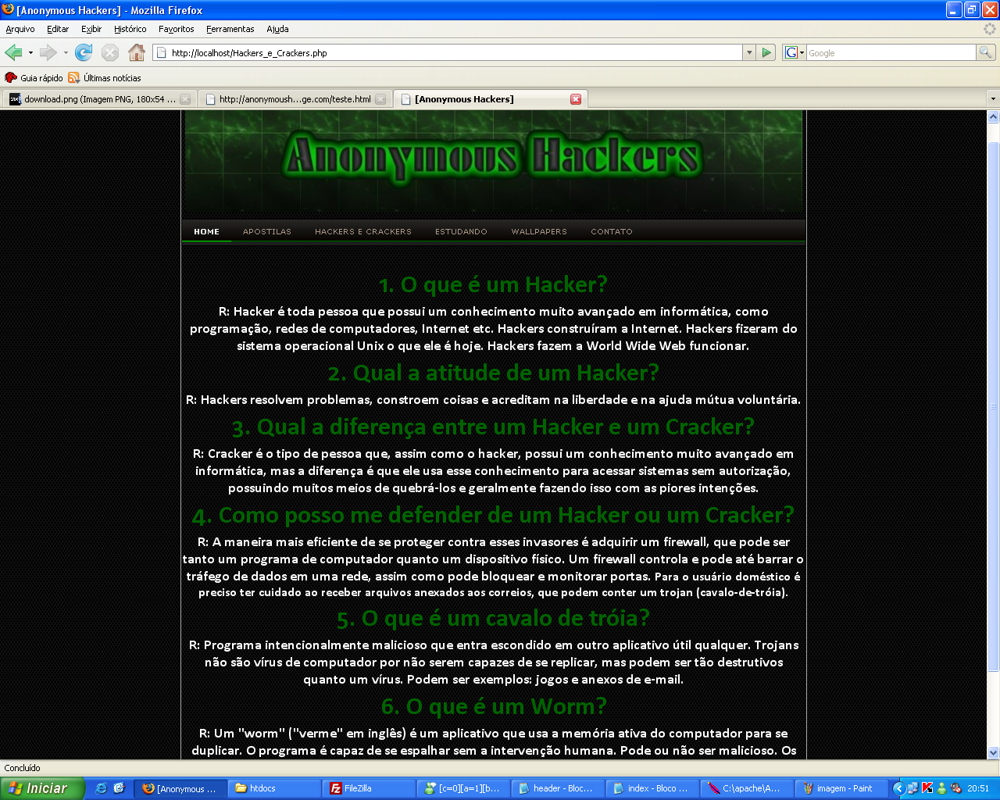

# Meu primeiro site - Anonymous Hackers!

Este foi o meu primeiro site! 

Inicialmente, eu tinha a vontade de agariar e compartilhar conhecimentos na área de *hackering* através do site, mas ao desenvolver as páginas (**em 2009**), o lado desenvolvedor falou mais alto e isso foi deixado de lado. Após disso, a jornada para aprender novas linguagens cresceu... Você pode ver o que ando fazendo da vida pelo site [https://carlohcs.com.br](https://carlohcs.com.br).

E com vocês, imagens do *póstumo* site **Anonymous Hackers**!

## Home

## Home - Questionários/links

## Home - Rodapé

## Home - Folding de categorias

## Apostilas

## Definição de Hackers e Crackers

## Estudando

## Wallpapers

